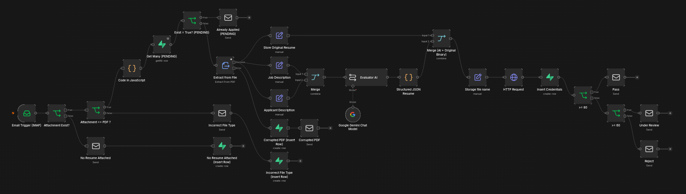

# AI Resume Screening Pipeline

An automated AI-powered resume screening pipeline built with **n8n**, **Google Gemini**, and **Supabase**. The workflow validates incoming applications, detects invalid submissions, extracts applicant information, evaluates resumes against a job description using AI, stores applicant data and original resumes, and automatically responds to applicants based on screening results.

---

## Overview

Recruiters often spend significant time manually opening resumes, checking file validity, reviewing qualifications, and sending acknowledgement emails.

This project automates the entire initial screening process.

Applicants simply send their resume via email, and the workflow automatically:

- Validates the submitted attachment
- Rejects invalid or corrupted files
- Detects duplicate submissions
- Extracts applicant information
- Screens the resume using Google Gemini
- Stores structured applicant information
- Uploads the original resume to cloud storage
- Sends an automated response based on the screening result

---

# Features

- Email-triggered automation using IMAP
- PDF attachment validation
- Missing attachment detection
- Incorrect file type detection
- Corrupted PDF detection
- SHA-256 duplicate resume detection
- AI-powered resume evaluation using Google Gemini
- Structured JSON parsing
- Automatic applicant information extraction
- Resume upload to Supabase Storage
- Applicant metadata stored in Supabase PostgreSQL
- Automated applicant email responses
- Modular workflow built entirely in n8n

---

# Architecture

```
Applicant
     │
     ▼
 Gmail (IMAP Trigger)
     │
     ▼
Attachment Validation
     │
     ▼
PDF Validation
     │
     ▼
SHA-256 Hash Generation
     │
     ▼
Duplicate Detection
     │
     ▼
PDF Extraction
     │
     ▼
Applicant Information Extraction
     │
     ▼
Google Gemini Resume Screening
     │
     ▼
Structured JSON Parsing
     │
     ├──────────────► Supabase Storage
     │
     ▼
Supabase Database
     │
     ▼
Automated Email Response
```

A visual version of the workflow can be found in:

```
docs/images/workflow.png
```

---

# Technology Stack

| Technology | Purpose |
|------------|---------|
| n8n | Workflow automation |
| Google Gemini | AI resume evaluation |
| Supabase Storage | Resume storage |
| Supabase PostgreSQL | Applicant database |
| Gmail (IMAP) | Email trigger |
| JavaScript | Custom Code nodes |
| SHA-256 | Duplicate detection |

---

# Workflow

The workflow consists of several stages.

## 1. Email Reception

The workflow listens for incoming emails using Gmail IMAP.

---

## 2. Attachment Validation

Checks whether:

- an attachment exists
- exactly one attachment is provided
- the attachment is a PDF

Applicants are automatically notified if validation fails.

---

## 3. PDF Validation

The PDF parser attempts to extract text.

If extraction fails, the workflow assumes the PDF is corrupted and informs the applicant.

---

## 4. Duplicate Detection

A SHA-256 hash is generated from the original PDF.

The hash is compared against previously stored hashes inside Supabase.

If a duplicate is found:

- the workflow terminates
- the applicant receives a duplicate submission notification

---

## 5. Resume Parsing

Applicant information is extracted, including:

- Name
- Email
- Location

---

## 6. AI Screening

Google Gemini evaluates the resume against a predefined job description.

The model returns structured JSON containing:

- Score
- Recommendation
- Explanation
- Strengths
- Missing Skills

---

## 7. Resume Storage

The original PDF is uploaded to Supabase Storage.

The public URL is stored alongside the applicant record.

---

## 8. Database Storage

The following information is stored:

- Applicant Name
- Email
- Location
- AI Score
- Recommendation
- Explanation
- Strengths
- Missing Skills
- Resume URL
- Original Filename
- SHA-256 Resume Hash
- Timestamp

---

## 9. Automated Response

Applicants automatically receive an email based on their screening result.

---

# Database Schema

| Column | Type |
|---------|------|
| id | UUID |
| name | Text |
| email | Text |
| location | Text |
| score | Integer |
| status | Text |
| recommendation | Text |
| explanation | Text |
| strengths | JSONB |
| missing_skills | JSONB |
| resume_url | Text |
| original_filename | Text |
| resume_hash | Text |
| created_at | Timestamp |

---

# Engineering Decisions

## Why SHA-256?

Duplicate detection is based on the file contents rather than the filename.

Even if an applicant renames:

```
Resume.pdf
```

to

```
Final Resume.pdf
```

the generated hash remains identical if the contents are unchanged.

This provides reliable duplicate detection.

---

## Why Supabase Storage?

Resume PDFs are stored separately from structured applicant data.

Benefits include:

- smaller database records
- easier file retrieval
- scalable storage
- public or private bucket support

---

## Why Supabase PostgreSQL?

Supabase provides:

- PostgreSQL
- REST APIs
- Authentication
- Storage
- Dashboard

making it a convenient backend for workflow automation.

---

## Why Google Gemini?

Gemini produces structured JSON outputs suitable for automated decision making while providing detailed reasoning behind each recommendation.

---

# Repository Structure

```
.
├── docs
│   ├── architecture.md
│   ├── demo.md
│   ├── images
│   ├── test-cases
│   └── videos
│
├── workflow
│   └── resume-screening-workflow.json
│
└── README.md
```

---

# Test Cases

The workflow has been tested against multiple scenarios.

| Scenario | Status |
|----------|--------|
| Missing Attachment | ✅ |
| Incorrect File Type | ✅ |
| Corrupted PDF | ✅ |
| Duplicate Resume | ✅ |
| Successful Resume Screening | ✅ |

Detailed demonstrations can be found inside:

```
docs/test-cases/
```

---

# Future Improvements

- OCR support for scanned resumes
- Multi-language resume parsing
- Resume similarity detection
- Recruiter dashboard
- Interview scheduling automation
- Multiple AI model support
- Docker deployment
- CI/CD pipeline
- Analytics dashboard
- Candidate search

---

# Screenshots

Workflow




Architecture


docs/images/architecture.png


Duplicate Detection


docs/images/duplicate.png


Storage


docs/images/storage.png


---

# Demo

A complete walkthrough of the workflow is available in:

```
docs/demo.md
```

---

# License

This project is intended for educational and portfolio purposes.

---

## Author

**Renzo Isaac Takeda Mendoza**

Computer Science Graduate

Cloud • DevOps • AI Automation

GitHub: https://github.com/Vercii

LinkedIn: https://linkedin.com/in/renzotakeda
